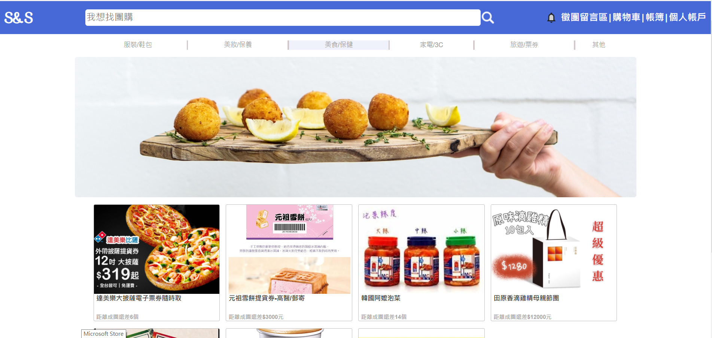
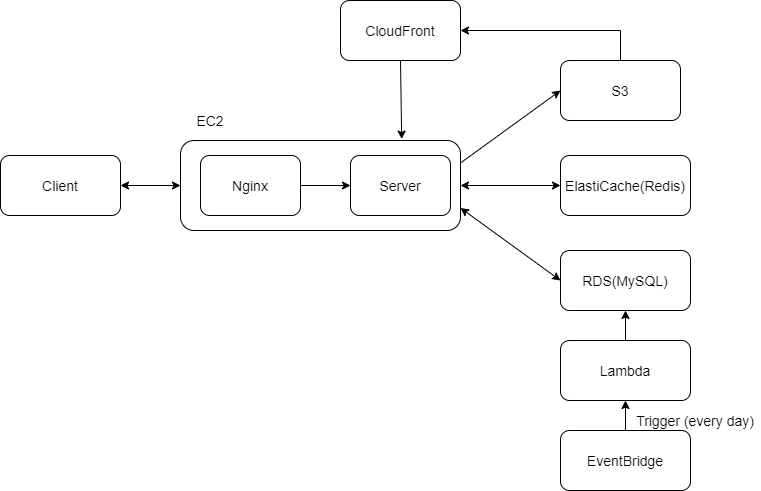
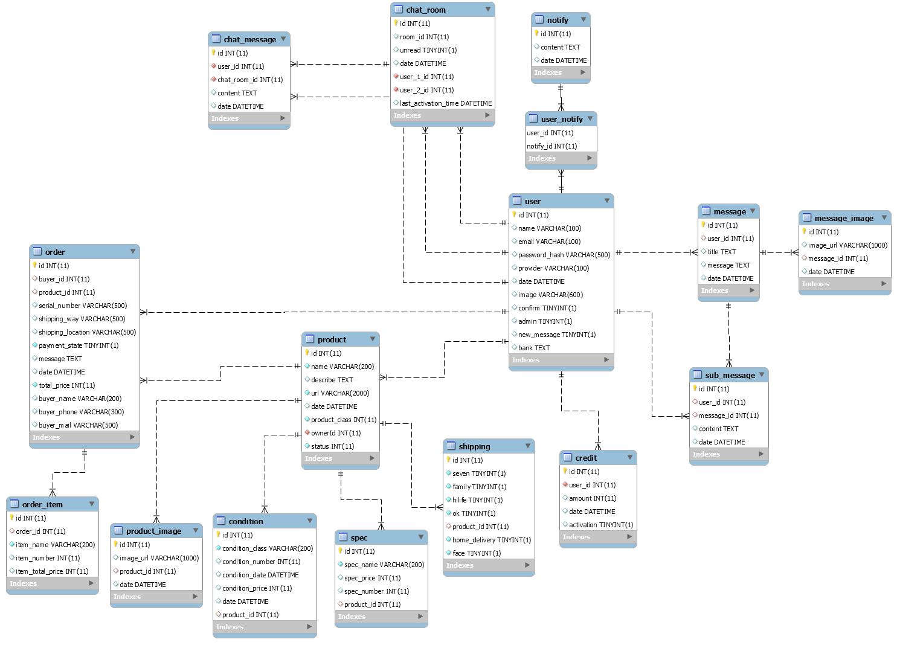

# [S&S(Shop&Share)](https://shauncc.site/)

---
## 專案主旨
本專案為一拍賣網站，但功能注重在團購的商品，並非一般商品，  
旨在讓團購主可以透過 S&S 並且根據各種不同的成團條件發出團購商品，  
而其餘使用者則可在首頁瀏覽到各種商品以及進行下單。  
## 系統架構  

  

## 資料庫結構
  
## 使用技術
* Frond-End  
HTML.CSS.JavaScript 部分以 Bootsrap 建置
* Back-End  
1. MVC 架構  
2. Python 框架為 Flask  
3. RESTful API
* Database  
1. MySQL
2. 網站部分以 ORM(Flask-SQLAlchemy) 進行操作
3. 設置 Index 加速搜尋  
4. 第二正規化
* Cloud
1. 網站架設於 AWS EC2
2. 資料庫使用 AWS RDS(雲端關聯式資料庫)
3. 圖片皆儲存於 AWS S3(Simple Cloud Storage)
4. 圖片呈現利用 AWS CloudFront
5. 快取及 Session 儲存於 AWS ElastiCache
6. 通知系統結合 AWS Lambda 以及 AWS EventBridge 定時排程通知
* Other
1. 上傳圖片若超過一定大小則進行壓縮(OpenCV)
2. 註冊需經過信箱驗證才能發起團購(Flask-mail)
3. 利用 Redis 進行快取設置(volatile-lru)以及 Session 管理
4. 以 Flask-Migrate 進行資料庫版本管理
5. 以 WebSocket 實作即時聊天功能
6. HTTPS以 Nginx 配合 SSL 憑證完成
7. 通知功能以短輪循方式實作
## 主要功能
* 團購商品管理  
團購商品的買賣管理與查詢
* 圖文留言板  
仿 Facebook 的簡易圖文留言板
* 聊天功能  
讓買賣家進行溝通  
* 金流管控  
所有金流皆經過 S&S 後團購主才能提出提款申請以及帳簿功能供會計使用
## 其餘
* 第三方登入(Google OAuth 2.0)
* 第三方金流(TapPay)
* 註冊驗證信
* 通知功能
* 搜尋功能
* 上傳圖片壓縮
